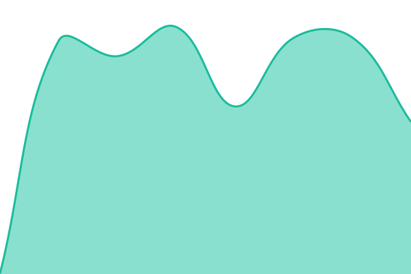

# [📈 Live Status](https://HarshZetigon.github.io/Fundnation-Status): <!--live status--> **🟩 All systems operational**

This repository contains the open-source uptime monitor and status page for [HarshZetigon](https://HarshZetigon.github.io/Fundnation-Status), powered by [Upptime](https://github.com/upptime/upptime).

With [Upptime](https://upptime.js.org), you can get your own unlimited and free uptime monitor and status page, powered entirely by a GitHub repository. We use [Issues](https://github.com/HarshZetigon/Fundnation-Status/issues) as incident reports, [Actions](https://github.com/HarshZetigon/Fundnation-Status/actions) as uptime monitors, and [Pages](https://HarshZetigon.github.io/Fundnation-Status) for the status page.

<!--start: status pages-->
<!-- This summary is generated by Upptime (https://github.com/upptime/upptime) -->
<!-- Do not edit this manually, your changes will be overwritten -->
<!-- prettier-ignore -->
| URL | Status | History | Response Time | Uptime |
| --- | ------ | ------- | ------------- | ------ |
|  [Fundnation Platform](https://staging.fundnation.cloud) | 🟩 Up | [fundnation-platform.yml](https://github.com/HarshZetigon/Fundnation-Status/commits/HEAD/history/fundnation-platform.yml) | 

 1260ms
     
 | 

<a href="https://HarshZetigon.github.io/Fundnation-Status/history/fundnation-platform">100.00%</a>
    

|  [Database](https://staging.fundnation.cloud/api/status?check=database) | 🟩 Up | [database.yml](https://github.com/HarshZetigon/Fundnation-Status/commits/HEAD/history/database.yml) | 

 420ms
     
 | 

<a href="https://HarshZetigon.github.io/Fundnation-Status/history/database">100.00%</a>
    

|  [Storage](https://staging.fundnation.cloud/api/status?check=storage) | 🟩 Up | [storage.yml](https://github.com/HarshZetigon/Fundnation-Status/commits/HEAD/history/storage.yml) | 

 403ms
     
 | 

<a href="https://HarshZetigon.github.io/Fundnation-Status/history/storage">100.00%</a>
    

|  [Bunny Storage](https://staging.fundnation.cloud/api/status?check=bunny_storage) | 🟩 Up | [bunny-storage.yml](https://github.com/HarshZetigon/Fundnation-Status/commits/HEAD/history/bunny-storage.yml) | 

 421ms
     
 | 

<a href="https://HarshZetigon.github.io/Fundnation-Status/history/bunny-storage">100.00%</a>
    

|  [Bunny CDN](https://staging.fundnation.cloud/api/status?check=bunny_cdn) | 🟩 Up | [bunny-cdn.yml](https://github.com/HarshZetigon/Fundnation-Status/commits/HEAD/history/bunny-cdn.yml) | 

 474ms
     
 | 

<a href="https://HarshZetigon.github.io/Fundnation-Status/history/bunny-cdn">100.00%</a>
    

|  [Stripe](https://staging.fundnation.cloud/api/status?check=stripe) | 🟩 Up | [stripe.yml](https://github.com/HarshZetigon/Fundnation-Status/commits/HEAD/history/stripe.yml) | 

 449ms
     
 | 

<a href="https://HarshZetigon.github.io/Fundnation-Status/history/stripe">100.00%</a>
    

|  [Paystack](https://staging.fundnation.cloud/api/status?check=paystack) | 🟩 Up | [paystack.yml](https://github.com/HarshZetigon/Fundnation-Status/commits/HEAD/history/paystack.yml) | 

 438ms
     
 | 

<a href="https://HarshZetigon.github.io/Fundnation-Status/history/paystack">100.00%</a>
    

|  [Mailgun](https://staging.fundnation.cloud/api/status?check=mailgun) | 🟩 Up | [mailgun.yml](https://github.com/HarshZetigon/Fundnation-Status/commits/HEAD/history/mailgun.yml) | 

 666ms
     
 | 

<a href="https://HarshZetigon.github.io/Fundnation-Status/history/mailgun">100.00%</a>
    

|  [SendPulse](https://staging.fundnation.cloud/api/status?check=sendpulse) | 🟩 Up | [send-pulse.yml](https://github.com/HarshZetigon/Fundnation-Status/commits/HEAD/history/send-pulse.yml) | 

 433ms
     
 | 

<a href="https://HarshZetigon.github.io/Fundnation-Status/history/send-pulse">100.00%</a>
    

|  [Zetigon SMS](https://staging.fundnation.cloud/api/status?check=zetigon_sms) | 🟩 Up | [zetigon-sms.yml](https://github.com/HarshZetigon/Fundnation-Status/commits/HEAD/history/zetigon-sms.yml) | 

 432ms
     
 | 

<a href="https://HarshZetigon.github.io/Fundnation-Status/history/zetigon-sms">100.00%</a>
    

|  [FreeCurrency API](https://staging.fundnation.cloud/api/status?check=freecurrency_api) | 🟩 Up | [free-currency-api.yml](https://github.com/HarshZetigon/Fundnation-Status/commits/HEAD/history/free-currency-api.yml) | 

 444ms
     
 | 

<a href="https://HarshZetigon.github.io/Fundnation-Status/history/free-currency-api">100.00%</a>
    

<!--end: status pages-->

[**Visit our status website →**](https://HarshZetigon.github.io/Fundnation-Status)

## 📄 License

- Powered by: [Upptime](https://github.com/upptime/upptime)
- Code: [MIT](./LICENSE) © [Anand Chowdhary](https://anandchowdhary.com)
- Data in the `./history` directory: [Open Database License](https://opendatacommons.org/licenses/odbl/1-0/)
